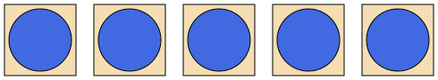

# kotsvg (very WIP)
A straightforward and easy to use library for creating SVGs in Kotlin. Follows the SVG spec closely in terms of naming.

## Overview

SVG Elements are structured in classes that contain their relevant methods and attributes; each element from the SVG spec has its own class.

Class constructors take geometry properties as arguments:
```
import kotsvg.SVG
import kotsvg.Rect

val svg = SVG(width = 100, height = 50)
val rectangle = Rect(x = 0, y = 10, width = 100, height = 40)
```

For transformable elements, the transformations can be chained:
```
val rectangle = Rect(0,10,100,40).translate(3).scale(0.5).rotate(180)
```
Any optional attributes can be passed as closures either when creating an instance of an element or after; this also applies to transformations:

```
import kotsvg.Circle
import kotsvg.Line

val circle = Circle(cx = 10, cy = 10, r = 10) {
  fill = "blue"
  stroke = "black"
  skewX(45)
}

val line = Line(x1 = 0, y1 = 0, x2 = 50, y2 = 50)
line {
  stroke = "green"

}
```

any invalid attributes will be labeled as such by the IDE.

## Examples

### Creating a simple group of elements

Here we create a simple SVG group with some elements in it, namely a sequence of circles surrounded by a box.  Child elements can be added to any element via the `add()` method:

```
val pad = 5
val svg = SVG(480 + 2*pad, 80 + 2*pad)
val g = Group() {id="boxArray"}

(0..4).forEach(
  {g.add(
      Rect(100*it + pad, pad, 80, 80) {fill = "wheat"; stroke = "black"},
      Circle(40 + 100*it + pad, 40 + pad, 35) { fill = "royalblue"; stroke = "black" }
  )}
)

svg.add(g)
svg.save("exampleGroup.svg")
```

This will create the following SVG image:



### Creating custom elements

At times it is convenient to define our own custom svg elements. The easiest way to achieve this is to create a new class that inherits `Group`:

```
class BoxedCircle(x: Double, y: Double, size: Double): Group() {
    val rect = Rect(x, y, size, size) { fill = "wheat"; stroke = "black" }
    val circle = Circle(x + size/2, y + size/2, 0.8*size/2) { fill = "royalblue"; stroke = "black" }

    init {
        this.add(rect, circle)
    }
}
```

We can then create a sequence as before:

```
(0..4).forEach(
    {g.add(
        BoxedCircle((100*it + pad).toDouble(), pad.toDouble(), 80.0)
    )}
)
```

Resulting in the same end image.


As we inherited from `Group()`, we have access to the same attributes for our class as `Group()` does. However, this means we cannot by default set e.g. a value for `fill`. For the previous example, this is fine, as having fill for the element would be ambiguous anyway. However, for an element like an arrow, it would make sense to be able to set the same values as for any other simple svg shape; this is when inheriting from shapes is more useful, however, this requires creating a private static method and calling that in the constructor (see `Arrow()` in custom.kt).


## Currently Implemented Elements

**Shape Elements:**
- Basic Shapes: `<circle>`, `<ellipse>`, `<line>`, `<polygon>`, `<polyline>`, `<rect>`
- Path Elements: `<path>`

**Container Elements:**
- Grouping Elements: `<g>`, `<defs>`
- Container Elements: `<svg>`
- Linking Elements: `<a>`
- Paint Server Elements: `<pattern>`
- Other: `<clipPath>`, `<switch>`, `<symbol>`, `<mask>`, `<marker>`

**Text Elements:**
- Text Content Elements: `<tspan>`, `<tref>`, `<textPath>`, `<text>`
- Descriptive Elements: `<desc>`, `<title>`
